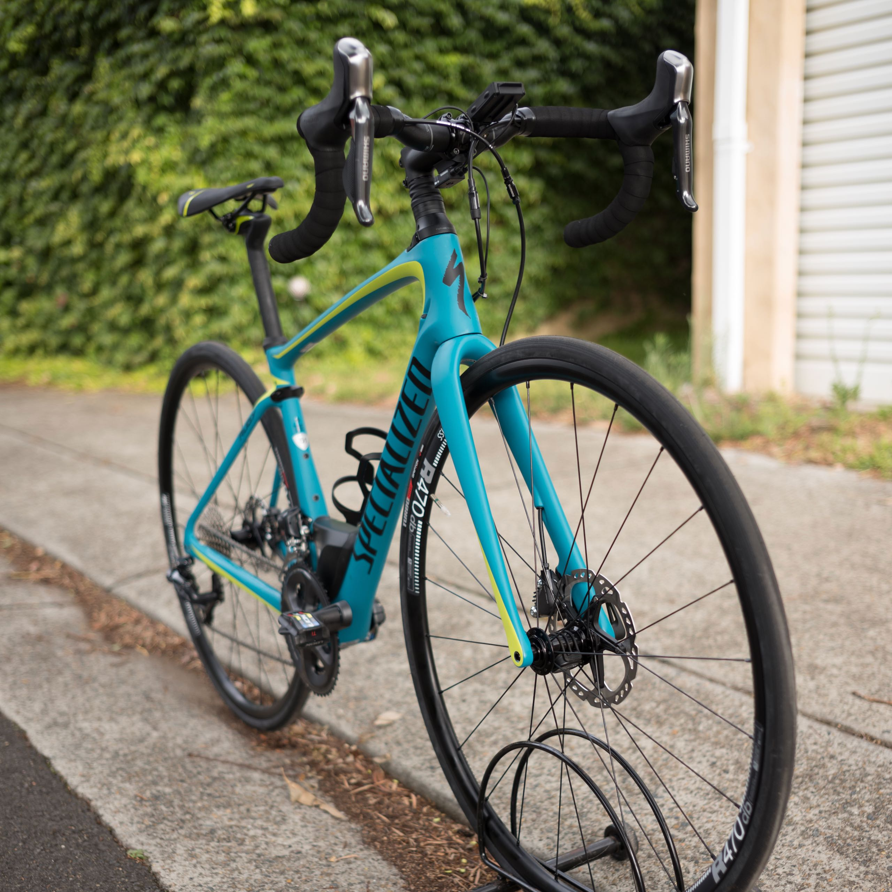

I have finally decided to replace my commuter bike (&#8220;Cadel&#8221; &#8211; my self-built bike based on an Olmo Kurva frame, Shimano Ultegra groupset, DuraAce wheels, 3T stem, handlebar and seat post and finzi:k saddle). The bike is approaching 7 years old (I completed the build on the day Cadel Evans won the Tour of France, hence the name). Although the bike still works, I noticed the steering has become less confident, particularly braking down a descent, so it was probably time for a change. Also, I mainly use it to commute to road, and the race geometry and components make it a fairly harsh ride over the roadworks around the city.

I strongly considered getting a Trek Project One custom build, but in the end I managed to get a good deal on the 2017 top of the range Specialised women&#8217;s bike; The Ruby Expert Ultegra Di2.

The bike description is on the [Specialized site][1] but here is a summary of the specs: it&#8217;s basically a comfort/endurance frame with front and rear suspension, Ultegra Di2 and disc brakes. I am particularly keen on getting disc brakes because I mainly intend to use the bike for commuting and need all the braking power I can get.

Here is a video of my first ride on the bike &#8211; wet conditions after heavy rainfall the night before at Lane Cove National Park:


And here is an example of a commute on the new bike:
<iframe src="https://www.facebook.com/plugins/video.php?height=314&href=https%3A%2F%2Fwww.facebook.com%2Fchris1.tham%2Fvideos%2F10213582491289440%2F&show_text=false&width=560&t=0" width="560" height="314" style="border:none;overflow:hidden" scrolling="no" frameborder="0" allowfullscreen="true" allow="autoplay; clipboard-write; encrypted-media; picture-in-picture; web-share" allowFullScreen="true"></iframe>

 [1]: https://www.specialized.com/au/en/ruby-expert-ultegra-di2/p/115588?color=214379-115588
